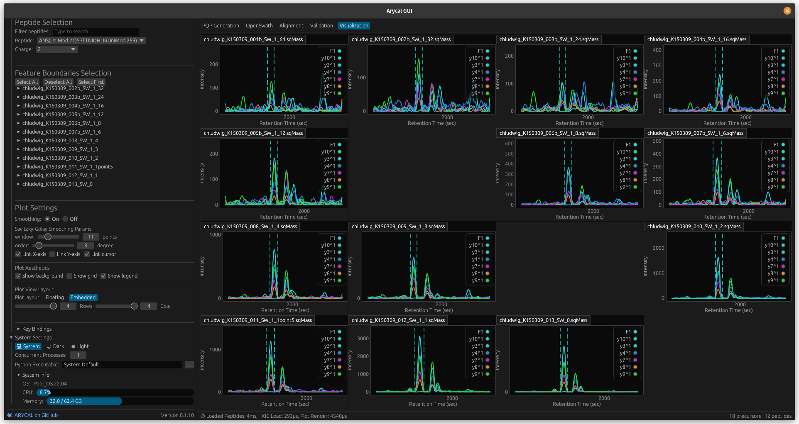

<p align="center">
  <picture>
    <source media="(prefers-color-scheme: dark)" srcset="https://github.com/singjc/arycal/raw/master/assets/img/arycal_logo_new_transparent_small.png" alt="ARYCAL_Logo" width="200">
    <source media="(prefers-color-scheme: light)" srcset="https://github.com/singjc/arycal/raw/master/assets/img/arycal_logo_new_transparent_small.png" alt="ARYCAL_Logo" width="200">
    
  </picture>
</p>

---

# ARYCAL: Across Run dYnamic Chromatogram ALignment

[](https://github.com/singjc/arycal/actions/workflows/rust.yml)


## Overview
**ARYCAL** is a Rust-based tool for aligning extracted ion chromatograms (EICs) across multiple runs from targeted DIA mass spectrometry data. ARYCAL is based on  similar principles as [DIAlignR](https://github.com/shubham1637/DIAlignR), using dynamic programming to align precursor chromatographic traces across multiple runs. In addition, ARYCAL supports the use of fast Fourier transform (FFT) for alignment, which can reduce the time required for alignment.

## Features

- **Standalone command-line** (`arycal`) executable for:
  - Fast and efficient chromatogram alignment
    - Supports dynamic time warping (DTW), fast Fourier transform (FFT), and a combination of FFT refined by DTW alignment methods
  - Scoring quality of alignment
    - Full trace alignment is scored based on cross-correlation coelution score, peak shape similarity and mutual information.
    - Individual peak mapping across runs is scored using the same metrics.
    - A set of decoy aligned peaks is generated (random shuffling of query peak or random region selection) to estimate the quality of peak alignment.
    - If using the IPF OpenSWATH workflow, alignment (based on detecting transitions) and scoring of individual transitions peak mappings is also supported.
  - Currently only supports output from OpenSWATH (OSW feature files and sqMass XIC files)
- **Native desktop GUI** (`arycal-gui`) providing an end-to-end, tabbed workflow:
  1. **PQP Generation** — build peptide query parameter assay libraries  
  2. **OpenSWATH Workflow** — configure & launch OpenSWATH feature extraction and scoring
  3. **ARYCAL Alignment** — run across-run dynamic alignment  
  4. **Statistical Validation** — semi-supervised scoring with PyProphet for FDR estimation  
  5. **Visualization** — interactive tabs for  
     - Extracted ion chromatograms (EIC)  
     - Peak boundary overlays  
     - Linked‐axis and cursor across multiple runs  



## Installation

### Precompiled Binaries

[](https://github.com/singjc/arycal/releases/download/v0.1.10/arycal-.v0.1.10.-arycal-x86_64-apple-darwin.tar.gz)
[](https://github.com/singjc/arycal/releases/download/v0.1.10/arycal-.v0.1.10.-arycal-x86_64-pc-windows-msvc.zip)
[&color=blue)](https://github.com/singjc/arycal/releases/download/v0.1.10/arycal-.v0.1.10.-arycal-x86_64-unknown-linux-musl.tar.gz)
[&color=blue)](https://github.com/singjc/arycal/releases/download/v0.1.10/arycal-.v0.1.10.-arycal-x86_64-unknown-linux-musl-mpi.tar.gz)
[](https://github.com/singjc/arycal/releases/download/v0.1.10/arycal-gui-.v0.1.10.-arycal-gui-x86_64-apple-darwin.tar.gz)
[](https://github.com/singjc/arycal/releases/download/v0.1.10/arycal-gui-.v0.1.10.-arycal-gui-x86_64-pc-windows-msvc.zip)
[](https://github.com/singjc/arycal/releases/download/v0.1.10/arycal-gui-.v0.1.10.-arycal-gui-x86_64-ubuntu_22_04-linux-gnu.tar.gz)


Precompiled binaries are available for Linux, MacOS, and Windows. You can download the latest release under the assets from the [releases page](https://github.com/singjc/arycal/releases)

### Build from Source

#### 1) Command-line Tool

To build ARYCAL from source, you will need to install the Rust toolchain. You can install Rust using `rustup`, the official Rust installer.

```bash
# Clone the repository
git clone https://github.com/singjc/arycal.git
cd arycal

# Build the command line tool using Cargo
cargo build --release --bin arycal
```

If you're working on an HPC, you can add the `--features mpi` flag to enable MPI support for distributed computation across multiple nodes.

```bash
cargo build --features mpi --release --bin arycal
```

#### 2) GUI Application

To build the GUI application, run the following command in the root directory of the repository:

```bash
cargo build --release --bin arycal-gui
```

### Docker

ARYCAL (CLI) is also available via [docker images](https://github.com/users/singjc/packages/container/package/arycal):

Pull the latest version:

```bash
docker pull ghcr.io/singjc/arycal:master
```

## Usage

ARYCAL is a command-line tool that uses a json configuration file to specify parameters for the tool. 

```bash
# Run ARYCAL 
arycal arycal_config.json
```

<details>
<summary> <b>Example Config</b> </summary>

Remove the comments before running the configuration file.

```json
{
  "xic": {
    # Use the precursor chromatogram in the alignment
    "include-precursor": true,
    # Number of precursor isotopes to use
    "num-isotopes": 3,
    # The extraction ion chroamtogram input file type (Currently only sqMass is supported)
    "file-type": "sqMass",
    # The file paths to the XIC files
    "file-paths": [
      "data/xics/hroest_K120808_Strep0%PlasmaBiolRepl1_R01_SW.sqMass",
      "data/xics/hroest_K120808_Strep0%PlasmaBiolRepl1_R02_SW.sqMass",
      "data/xics/hroest_K120808_Strep0%PlasmaBiolRepl1_R03_SW.sqMass"
    ]
  },
  "features": {
    # The feature file type (Currently only OSW is supported)
    "file-type": "osw",
    # The file paths to the feature files (Currently only one file is supported, assumming it's a merged OSW file of all runs)
    "file-paths": [
      "data/merged.osw"
    ]
  },
  "filters": {
    # Whether to include decoy precursor XICs to align as well (false means decoys are included)
    "decoy": false,
    # Whether to align and score identifying transitions
    "include_identifying_transitions": false,
    # A TSV file (with header) to filter for precursor ids to align
    "precursor_ids": null,
  },
  "alignment": {
    # The batch size for aligning N precursors for a given thread
    "batch_size": 1000,
    # The alignment method to use (Currently supports DTW, FFT, and FFTDTW)
    "method": "FFT",
    # The type of reference to use (Currently supports star, mst, progressive)
    "reference_type": "star",
    # Specifies the reference run to use (otherwise a random run is selected each time). Only used if reference_type is set to "star"
    "reference_run": null,
    # Whether to use the total ion chromatogram (TIC) for alignment. (Currently only supports true, as the alignment path is usually monotonic for the MS2 transitions)
    "use_tic": true,
    # Smoothing parameters for the chromatogram (Currently only supports Savitsky-golay smoothing)
    "smoothing": {
      "sgolay_window": 11,
      "sgolay_order": 3
    },
    # The tolearance for mapping query peaks to the reference run using the alignment result
    "rt_mapping_tolerance": 20.0,
    # The method for generating decoy aligned peaks. (Currently supports shuffle, random_regions)
    "decoy_peak_mapping_method": "shuffle",
    # Size of the window to use for the decoy peak mapping. Only used when the method is random_region.
    "decoy_window_size": 30,
    # Compute the scores for the alignment
    "compute_scores": true,
    # Optionally write out the scores to a separate file (sqlite), otherwise the scores are written to the feature input file
    "scores_output_file": null
  }
}
```

</details>

